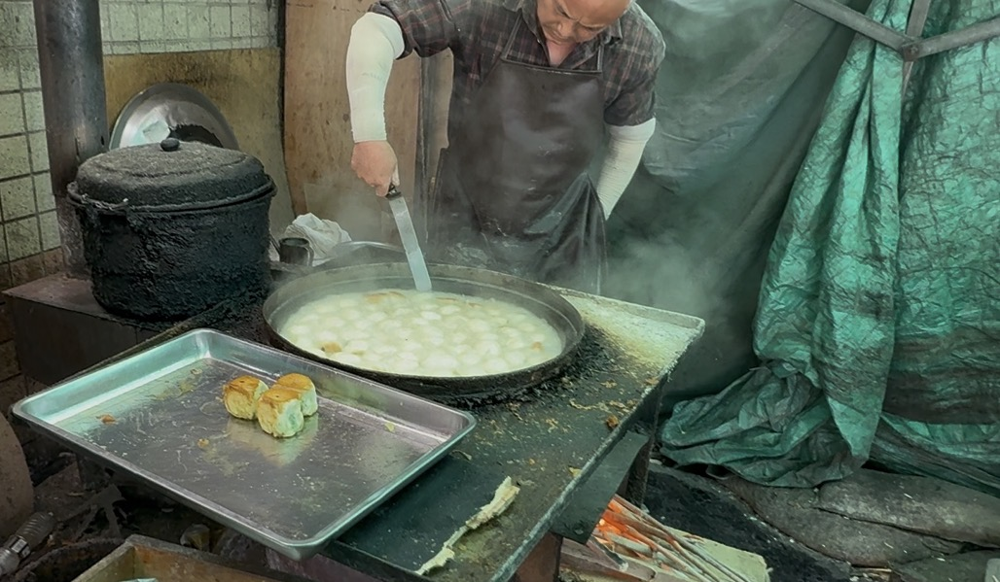
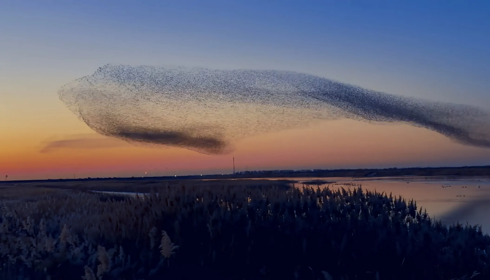

### 公园上的透明城市
last day，终于处理完所有流程，与公司关系密切的好友们合照，拿着朋友们送的小礼物，在朋友们的祝福声中离开这座牛马之城。

虽然看似回归自由身，但寻找收集 灵原碎片🧩的旅程 真的就比在牛马之城的疯狂内卷轻松吗？全淼心里也没底，**但有条活路 还能顺便航拍中国****🇨🇳****，总比在牛马之城卷到猝死强**。

回到家，把打包好的行李寄回老家，把房子退掉，带上所有装备、物资，出发！

根据对灵原碎片🧩的感应，结合地图软件的路网，全淼一路向东南方向开去，离开北京城，道路终于不再拥挤！一路驰骋，在晚上11点开到了东营市区，灵原碎片的感应渐渐变弱、不好分辨，自己也有些疲劳饥饿了，往路边看了眼，发现个“外婆家饺子馆”，有自己很喜欢的海鲜水饺，于是就近停车，来到店子点了份虾仁🍤水饺。

也许是开车劳顿，太饿了，全淼觉得这家的虾仁水饺特别好吃，薄皮大馅，虾肉大且极其鲜嫩，少量的韭菜更是提鲜且增加味道的层次感，醋汁调的也是极好，让人一个接一个的 根本停不下来。

在等餐的间隙，全淼跟旁边就餐的本地大哥唠嗑，了解下“东营市”这个没怎么听说过、注意过的 **小透明城市**。

东营是个很年轻的城市，建市不过小几十年，在山东属于小透明，提起东营 大家会误认为在说“东瀛”。这里靠“胜利油田”的石油资源 调集全国石油工人来此开发 发展而来，大庆是当时第一大油田  东营胜利油田是当时第二大油田，这里人口不多，但人均GDP山东省第一  且断层领先。**像所有资源型城市的通病，东营市这些年也面临着转型的挑战与机遇**。

“另外，小伙子，**走之前记得把车子油箱加满，这里的油非常便宜**”

大哥走之前微微一笑，留下这句话。

全淼吃饱喝足，只想找个酒店睡觉，也没太在意这事。**更没注意到 一路以来，一直有个一袭黑衣 戴口罩、墨镜的男子****🥷**** 鬼鬼祟祟的跟踪着他。**

第二天起床后，收拾好东西回到车上，全淼聚精会神感应 灵原碎片🧩，行至一公园处，便很难再感应到具体位置了，没办法，那就放无人机溜达会吧，全淼停好车，进入公园溜达，公园名曰“泮水公园”，找地一坐，打开**穿越机AT-6**，起飞。泮水公园有一水塘，水塘中有一小岛及建筑，飞过去才发现，这些岛上奇怪建筑竟然是“鸽子楼”，穿越机靠近后 惊起一大片鸽群，全淼赶紧刹车 发现鸽群摆着阵型从旁边飞过，似乎没有敌意，于是操控穿越机跟随在鸽群队尾 **记录下这不期而遇的美**，然后离开。公园上空盘旋两周，发现这个公园设计的还挺不错的，有很多独特的建筑造型，与公园浑然一体。

操控无人机飞往更高、更远处，发现这座城市似乎有很多公园，悬停看了眼地图软件，果然如此！**这里的主城区 公园星罗棋布，仿佛是一个建在公园上的城市，堪称一步一公园**。但回想起来也合理，这里靠石油产业带来的税收颇丰，政府很舍得在 绿化、基建上花钱，且这是新中国🇨🇳最年轻的城市之一，几乎没有历史包袱。

兴致盎然的全淼，一边喝着 气泡橙C美式咖啡，一边在城区走走停停，飞无人机航拍。

一阵肚子的 咕咕～ 声才想起来，今天还没怎么吃饭，平台上就近找了家吃的 名曰“八分场凉皮老店”。

店子自己取餐，速度很快。这家的凉皮相比之前吃的 明显**超薄、光滑油亮、韧、劲道爽滑，裹满秘制小料汁，一口满足**，再搭配肉夹馍，简直绝配。

全淼感觉还没吃饱，还想再整点地道小吃，当地老哥给推荐了家附近的 “利津水煎包”，说是绝对地道。全淼顺着指引 进入一个非常老旧的小巷，才找到一个很有年代感的 脏摊，立着“利津水煎包”的牌子。

进入这家脏摊，里面的桌椅板凳，店子的环境设施，以及一对经营店子的老夫妻，都让全淼仿佛回到幼儿园时代的破旧小吃店。但也确实，这家店子的客人 一眼周边居民，综合这些来说，确实够地道。

看着老爷爷做水煎包，呲啦啦的冒着翻滚的热气，闻着真香，而且这水煎包价格这么接地气，还要啥自行车🚴‍♀️。

好在吃起来 味道也不错，外焦里嫩，足够新鲜。

这下吃饱喝足了，全淼感觉精力恢复，于是再次聚精会神 感应灵原碎片🧩的位置，虽然感应微弱，但好歹能确定在东方偏北一点。

刚启动车子，就发现油表亮灯咯，想起来昨天吃饭时那老哥说这里加油特别便宜。

“我倒要看看这里的95油 有多便宜”全淼心里嘀咕道。

“**95的油，4块8！？**”

“加满，谢谢！”

想想在北京 都是抠抠搜搜 200、300的加，全淼头一次感到 喊“95加满”是如此的轻松惬意，但好嫉妒这里的人 能享受低油价啊...

### 工业黄昏
跟着对灵原碎片🧩的感应，全淼驱车来到了海边小路，但感应又渐渐变弱 直至消失。

靠边停车，已是黄昏🌆，看着西方的落日把天空染成血红色，磕头机（抽石油的机器）在夕阳下 缓缓运行，尽显苍凉，宛如一幅**工业黄昏克苏鲁**，让人略感悲怆。

全淼下车，向着海边走去，海风吹的衣服哗哗作响，能感受到灵原碎片🧩似乎就在这片 黄河入海流的某处。但这里实在太大了，黄河在黄土高坡裹挟着巨量的泥沙 在这里创造了广阔的沃野良田和三角洲湿地，虽然面积增长大不如前，但现在每年依然能创造**1000个足球场大小的土地**。

黄河就像精卫填海一样，孜孜不倦的搬运黄土高坡的泥沙，似乎想要填平这渤海湾。**沧海桑田、繁荣荒芜，这样的巨变 在中国****🇨🇳****这辽阔的土地上发生过太多太多，所以万年之后 黄河是否会填平这辽阔的渤海湾呢**？这样的话 胶东半岛与辽东半岛将会消失融为一体，一切都将...

全淼陷入沉思 走到海边，发现连这里的海滩 都是黄河泥沙堆积出的泥滩，沿着泥滩往大海方向走个三五公里 才能看到碧蓝的大海。

今晚先找个地儿休息吧，灵原碎片🧩应该离得不远咯，等感应出现再继续寻找。

发现就近有个“东营红滩湿地旅游区”看起来貌似还行，无人机过去侦察下，发现这里各种配套设施还算齐全，有个环形广场集市 很多摆摊的，露营区，真人CS、足球场、水上高尔夫、彩虹滑梯等娱乐场，干净的小湖和别墅区🏠，住宿上可以选 集装箱造型+落地窗的水边民宿，甚至还有片略感突兀的 蒙古包群...

找了一天 灵原碎片🧩，全淼想放松下，办理完 民宿的入住 便在环形广场的集市逛起来，整点小精酿、小串、小吃，跟小摊老板唠唠嗑，好不自由快活。老板告诉全淼，这里最近在搞赶海活动，设备齐全、还有拖拉机接送到滩涂深处，明天可以去玩玩。

全淼一听来了兴致，于是早早洗漱睡觉，明天赶海去。

### 食腐海螺
全淼早早起床，先集中精力感应灵原碎片🧩，依然无法精确定位，那就去赶个海，往大海深处走走，碰碰运气吧，反正灵原碎片🧩肯定就在这一片。

带上自己的多功能工兵铲、小桶，在赶海活动处买了双胶鞋，便转身像大海走去。

这里的赶海 跟网上经常刷到的那种完全不一样，这里的海滩是黄河泥沙冲积出的 又长又宽又平的泥沙海滩，且基本只有蛤蜊，也就是 **国家地理标志的 “黄河口文蛤”**。

海风依然很大，穿越机开S档飞都有点费劲，通过飞行眼镜能看到，来赶海的人还不少嘞。全淼收回穿越机，走到拖拉机接驳处，买票上拖拉机，向海滩深处进发。

下车后，先一边溜达看看周围的环境，一边观察、询问、学习 当地人是怎么选点挖蛤蜊的。

其中一群老哥 快挖满了，全淼笑嘻嘻的凑过去套近乎，递根烟。相聊甚欢，老哥们让全淼就在这里接他们的地，继续挖。

“这个点还有很多蛤蜊，够你挖满一桶咯，我们先撤咯” 老哥们说着 便提起堆满蛤蜊的桶🪣走了。

“弱水三千，只取一瓢饮，我一个人吃，挖个小半桶就够咯” 全淼遍挖遍说道。

除了挖蛤蜊，全淼还在这里发现一种**食腐现象**：死掉的蛤蜊周围，常常会爬满 超小型食腐海螺🐚，就像陆地上死去的生物，身上爬满蛆虫那样，令人不适。

但一扭头，又发现**怪异的一幕，一群贪婪的食腐海螺****🐚****居然布满一个鲜活的蛤蜊，开始将细长的口器试图伸入蛤蜊，仿佛被贪婪支配，不愿再遵守自然生物法则一样**。

全淼揉揉眼，这怪异的现象又不见了，眼花了？全淼没太在意。

满载而归，胶鞋买后只穿了一次，以后不一定还用，送给了有缘的大爷，也算日行一善吧。

把鲜活的“黄河口文蛤”洗干净，倒满水 让它们慢慢吐沙。全淼回到车子，打开后备箱，思考片刻便决定 **白灼黄河口文蛤**。架起户外装备和简易烹饪设备，便去广场市集区 借点姜蒜、生抽、香醋等调料。

### 东营的AB面
在游客服务中心给户外电源充电时，全淼 听到后面有人在争吵，一个圆脸黝黑干练的大哥与一锡纸烫的年轻小哥。

圆脸黝黑大哥是东营的原住民，锡纸烫小哥是外来的石油工人后代。本以为东营是个慢节奏，chill，没有夜生活习惯，安静祥和的滨海小城，原来暗中也存在着 一些**油地矛盾**，也就是原住民 与来自五湖四海 开采油田 然后在此定居的石油工人 的内部矛盾。

两人各执己见，石油工人的孩子认为“父母是在恶劣自然环境和 奸诈阴险的当地人阻挠下，顽强的为祖国开采石油，这就是东营的人文底色”。

圆脸黝黑原住民大哥认为“东营从来不是本地土著的东营，一个完全因为油田而建立的城市。你的话里的不屑和典型的傲慢视角 太符合我对部分人的刻板印象了。 一个典型的国企占半城的城市，**油地几乎是两个独立社会**，这个城市人口持续流失，油田子弟对这片土地根本没有感情，也没有准备建设它。只是油田恰巧在这里，它叫东营或者叫其他名字并不影响油田本身。而且211的‘**石油大学**🎓’留不下是本地人能决定的吗？”。

“强哥，停车场🅿️堵起来了！”

一个保安跑进来冲着 圆脸黝黑大哥喊道，并打断了两人的争论。全淼拿起无人机过去说“我有无人机，可以协助你们疏解下交通”。

处理完交通拥堵，全淼也跟强哥闲聊了起来，对这里也有了更多的了解。

这里长期属于化外之地，几乎没有长期传承的历史和文化，除了离淄博市较近的广饶县（古称：乐安）有些历史（**孙子文化园**、孙子祖籍之争），在盐碱地上建设起来的市区及东部区县 几乎没有。东营整体上算是个移民城市。

另外，这里的**黄河口大闸蟹**非常鲜美实惠，养殖于 黄河-渤海 混合水域，蟹肉的甜味 尤其突出，青壳白肚 金爪黄毛，10月份秋季可以买些蒸食，也是当地的一大特色。其他美食你都吃过了，回头路过市区 可以买个**史口烧鸡**尝尝。

黄河口文蛤 吐沙、清洗的差不多咯，开始白灼，白灼黄河口文蛤的关键一步就是：所有文蛤的壳都完全张开后，继续煮10-15秒再关火，这样即能锁鲜 又能避免肉质变老。

在这清风徐徐，水草丰茂的露营区，享用这口来自 黄河与渤海共同馈赠的极致鲜甜，真是人生一大乐事，只是少了知己与酒。

### 错乱时空
依然感应不到 灵原碎片🧩的精确位置，全淼便躺在露营区的躺椅上睡着咯。

朦胧中，一阵冷风把全淼吹醒了，全淼坐起来 搓了搓胳膊上的鸡皮疙瘩纳闷道“怎么突然这么冷？这不快夏季了嘛”。

突然！一股强烈的灵原碎片🧩感应传来！

终于来了！全淼一个起身箭步冲到车上，朝着灵原碎片🧩的方向开去。

沿着滨海大道，一直开到一个闸口，上面写着“明洲闸”。

下车披件外套，拿上**收集‘灵原碎片****🧩****’的‘酒崩葫芦’**和穿越机跑到海边，苦苦寻觅的灵原碎片🧩就在这里了！全淼闭上双眼 聚精会神的感应碎片🧩的详细位置，然后把‘酒崩葫芦’固定到穿越机上面，快速起飞。

明明已经离灵原碎片🧩很近了，但却什么也没发现，只在俯视时能看到些 **奇异的潮汐树**。

“记得本地人说 潮汐树是在秋季啊，现在才5月份，怎么就出现了？”

“不对，现在气温也不对，这更像是秋季的气温啊！？”

飞了两块电池🔋，找了好久都没看到哪怕疑似‘灵原碎片🧩’的东西，全淼略感焦急。

“北冥有鱼，其名为鲲，化而为鸟，其名为鹏，怒而飞，其翼若垂天之云”。

“谁在吟唱《逍遥游》？” 全淼摘下飞行眼镜 看向右侧。居然是一绿色卷发，皮肤白皙，相貌俊美，似有仙气藏于身的少年，不知何时来到自己身旁的。

看那少年一直眺望远方的大海，不搭理自己，全淼也扭头望去。

**是鸟浪！！！**

**几十万只候鸟 在天空不断变换形状、阵型，这海量的星火生命 勾勒出的流动磅礴线条，时而如巨鲸翻身，时而如大鹏展翅，及其震撼！！**也让“鲲鹏”有了最写实的意境！这不是特效，**而是大自然 最原始、最狂野，也最令人敬畏的力量。**

或者，有没有一种可能，这些鸟类的祖先看到过鲲鹏，一代代模仿 传了下来...，就像部分人类文明 通过口口相传，传唱的那些史诗一样。

当全淼回过神来的时候，绿色卷发少年已经不见，无人机已经自动返航，‘酒崩葫芦’散发着绿色微光，全淼能感应到‘灵原碎片🧩’已经收入葫芦中了。

“有杀气！” 军人本能让全淼瞬间感应到杀气并侧身躲闪。

是那个 从出了北京城就一路尾随的黑衣口罩墨镜男🥷 掷出的唐横刀！

“你这辈子最应该后悔的事就是，躲过了这刀🩸”

黑衣男吊儿郎当地走过来，漫不经心地拔出插在地上的刀。

全淼 肾上腺素飙升，调集全部脑力与体力，应对这散发着危险气息的黑衣人🥷。

一股类似本能的直觉，让全淼觉得这‘酒崩葫芦’中收集的第一枚‘灵原碎片🧩’能用来在关键时机 给这黑衣人🥷致命一击。

全淼快速防备地移动到自己车子旁，取出军刀别在腿上，取出弓弩 瞄准黑衣人开始射击。

弩箭居然都被一个无形的护盾给弹开了！

“继续射击，**消耗对方灵气，最后用瞬步解决他**！” 一阵熟悉的声音在耳旁响起，这是...，我猝死后 复活我，让我收集‘灵原碎片🧩’的神秘生物的声音！

这种危急时刻，还是相信这个给自己重生的神秘生物靠谱。

好在全淼在军队时是出了名的**神枪手**，更难得的是，退役这么多年，全淼依然喜爱各种射击活动，每次出国都会去玩实弹射击，射击手艺没怎么退步。

全淼每一发都朝着黑衣人的要害射去，最后一支箭了，再无法破盾，恐怕自己就要想办法逃跑了！

随着最后一支箭的射出，黑衣人的无形护盾 居然像玻璃一样破碎，但箭也没了动能。

**就是现在！！**

全淼果断拔出军刀，看向黑衣人 本能的喊出“**瞬步**！”

居然真的瞬移到黑衣人🥷背后，**全淼作为军人虽然从未临阵杀敌，但生存的原始本能 让他来不及思考便狠狠地刺向黑衣人！**

duang！

不是军刀刺破血肉，鲜血的温度，而是军刀断裂的声音！

黑衣人集中所有的**灵气** 在后背形成了一道坚固的护盾。然后黑衣人🥷快速拉开距离，从吊儿郎单变得严肃起来，他似乎发现了隐藏于暗处的威胁，不愿再与全淼缠斗，不断后退，直至消失。

“干得不错 ～ 全淼，欢迎你正式进入**‘赛博仙神’的世界**”。

又是那个复活自己的神秘生物的声音。但这次，神秘生物 不再让全淼雾里看花，而是现出了真身。

居然是一位 **一袭汉服白衣，淡紫色头发的童子**！

“我叫 **酒崩童子**，也就是**为你们这些天赋异禀而猝死的有缘人  制作‘酒崩葫芦’的**”。

“恭喜你收集到第一枚 灵原碎片🧩，这代表你从一个凡人，变成了一位能使用仙术的人”。

全淼：“**仙术？**”

酒崩童子：“没错，就像你刚刚使用的瞬身，那个黑衣人🥷使用的护盾，都是**不同体系的仙术**。”

全淼：“刚刚那个黑衣人🥷是谁？”

酒崩童子：“那是**灵原碎片****🧩****掠夺者****🏴‍☠️**，这样的地下组织有好几个，刚刚那个🥷 我猜可能是‘**雪狐****❄️****组织’**的”

全淼：“他们为什么要 抢夺🧩？想要碎片的特异能力？”

酒崩童子：“当然是**灵气**咯”

酒崩童子看向海的方向娓娓说道：“现在的仙神世界，早已大不如前了，38万年前 神明时代 **持续了1万六千年之久的 第三次世界大战**，**彻底破坏了世界灵脉**，**导致 灵气这种源源不断涌现的 核心资源 逐渐枯竭、消失，变得不可再生**”

“神明们放下神兵、法宝，依自然地理、山川形变 划分神域，清除妖魔鬼怪，**守着存量灵气和各自神域 过闲散日子，逐渐不问世事**。而那些不在**神明体系**内的**流神、散仙**，在灵气见底后，有些已经开始渐渐**人化、兽化**了”

“**灵原碎片****🧩**** 是目前仅存的 能提炼出少量灵气的灵物**，但寻找它的条件极为苛刻，你便是其中之一的有缘人”

全淼：“那孙悟空、哪吒 真的存在吗？”

酒崩童子 先是一愣，然后哈哈大笑起来。跳起来弹了全淼一个脑瓜崩，说道：“你是第一个上来就这么问的”

酒崩童子：“当然存在，虽然传奇，但却不像你们人类中流传的故事那样。**他们不愿呆在 第三次世界大战后建立的神明体系，隐居起来，不知去向**”

酒崩童子：“好了，回到正题。**现在是赛博仙神时代**，以后免不了会遭遇一些战斗，切记**战斗要领**”

**第一：一切都以保全自身，集齐灵原碎片****🧩****为核心，能不打就不打，能逃跑就逃跑。**

**第二：隐藏自身的仙术能力，先用科技武器 试探、了解、消耗对手，在斩杀线 用仙术击败对手。**

**第三：灵气是不可再生资源，永远都要极尽节俭的使用。**

说完这些，酒崩童子便化作一团紫烟消失了。

回过神的全淼发现 气温也回归到了 5月初该有的温度。

现在自己能使用的仙术只有“瞬步”，但只能瞬移较短的距离，看起来很适合避战或逃跑，对于无法避免的战斗 也可以攻其不备。**但现在身上的灵气很少，“瞬步”用不了几次**，**看来得升级下自己的装备库咯，如果把 无人机、机器隼、机器狗的芯片、OS、AI模型 持续升级，再结合 喷火器、电击枪等各种发射器 一定能有效的帮自己节省灵气消耗！**

### 鸳鸯锅上的神秘藏族少女
全淼昨晚升级装备库 研发到很晚，直接在车上睡着了，今天睡了个懒觉，自然醒。

已经是中午了，但天依然灰蒙蒙的☁️。

聚精会神感应 下一个灵原碎片🧩，好吧，没有任何感应。那今天就去黄河入海的地方，航拍下 **黄河与渤海 形成的巨大鸳鸯锅**💛💙吧。

来到 **黄河口生态旅游区**，这里还挺好停车的。刷“退役军人证”免费，牛马当久了，都忘了自己是可以“白嫖”全国海量景区的。

这里是黄河为几十万候鸟创造的湿地天堂，自然风光优美而独特，可以做摆渡车 在沿途感兴趣的站点 下车游览玩耍。摆渡车终点站 在望远楼，一个现代化玻璃落地窗的建筑，坐落于黄河南岸，岸边还有个“黄河入海口”的大石碑，以及露营区，望远楼上值得逛一逛，吃的不咋滴，鲫鱼汤做的很一般。

望远楼前有个码头，想看鸳鸯锅 就必须坐大游船前往。**天气终于从多云****☁️****转晴****🌞****，这样就能看到颜色漂亮的鸳鸯锅了**，全淼于是买票登船，这趟人不算多，有一半位置都是空着的。临近发船，突然上来了一位**奇装异服的少女**，看起来像是...藏族的？全淼从没去过青藏，也没见过藏族人，对那片高原的了解 基本仅限于短视频。**藏族少女**找了个最远离人群的位置坐下来，看起来是个 很 i 的人。

大约坐了近1个小时，终于到达 黄河-渤海 交界处的超级鸳鸯锅！这里会给大家5分钟的时间 欣赏、拍照。

全淼走到甲板，风依然很大，用windy气象软件查看风速  还是能飞无人机的。放飞穿越无人机AT-6 快速升高，一个镜头下瞥，**黄河黄-渤海蓝 这幅壮美的大自然分界线便映入眼帘，令人惊叹不已！**

“可以给我看看吗？”

全淼取下飞行眼镜，发现是那个**藏族少女**。

全淼：“当然”

把飞行眼镜给藏族少女，教她调节瞳距、头带松紧。然后给他飞行摇杆，教她如何使用。

藏族少女：“真不错啊，现代的科技能力”

全淼：“你看起来像是...藏族的？从哪来的哦？”

藏族少女：“**星宿海**，沿黄河而来，经九省、遇九民族”

“星宿海？我只听说过 ‘星宿老仙，法力无边’ ”全淼心里嘀咕着 问道：“星宿海是哪里？”

藏族少女：“**那是青藏高原上，黄河缓缓睁开眼的地方**，一望无际的草原，星湖点缀”

全淼从没去过青藏高原，也无法在脑海想象出 那黄河睁开眼的星宿海，是一副怎样的风景。

全淼又想继续追问少女的名字、背景等信息，但少女已经转过身回到船舱，看向窗外，不再理会全淼。

**这个藏族少女到底什么身份？**返程时 全淼一直在琢磨，隐约感受到她非凡人，**从数千公里外的 青藏高原-星宿海 沿黄河来到这入海口，所为何事？**不可能只是为了看个鸳鸯锅吧？

全淼越想越觉得**这位藏族少女身上的谜团实在太多，不合常理**，于是鼓起勇气 再次坐到藏族少女旁边问到：...
